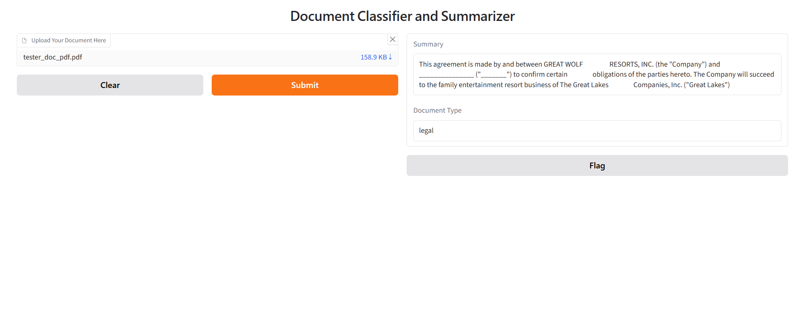

# Document Classifier and Summarizer

Analyzes any document and returns a concise summary along with 
its document type — legal, medical, financial, or general.
Supports both PDF and TXT file formats.

## What it does

- Extracts text from uploaded PDF or TXT files
- Summarizes the document using BART (facebook/bart-large-cnn)
- Classifies document type using zero-shot classification (facebook/bart-large-mnli)
- Runs entirely locally — no paid API calls

## Why it matters

Most organizations handle thousands of documents with no automated 
way to classify or summarize them at scale. This tool solves that 
using open source models — free to run, no data sent to external servers.

## Run it

```bash
pip install transformers torch gradio pymupdf
python app.py
```

## Tech Stack

- HuggingFace Transformers
- BART (facebook/bart-large-cnn) — Summarization
- BART (facebook/bart-large-mnli) — Zero-shot Classification
- Gradio — UI
- PyMuPDF — PDF text extraction

## Demo

